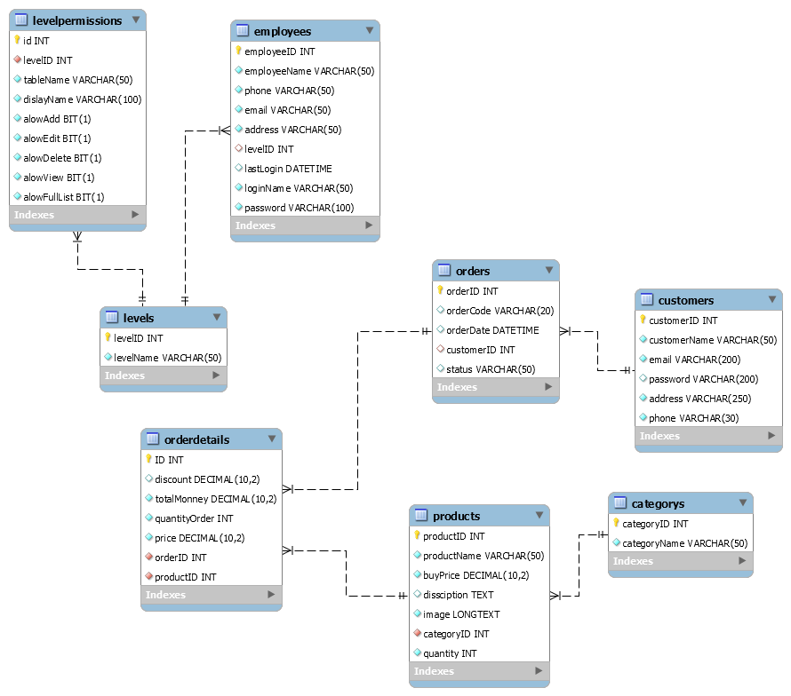

# Case-Study-PHP
- đề tài quản lý bán hàng (áo quần..)
sử dụng công nghệ ngôn nhữ lập trình html, css, bootstrap, php và database MySQL
- thành phần : + trang admin 
               + trang client
+ trang  admin(dashboar) cho phép : + thêm sản phẩm, sửa sản phẩm ,xóa sản phẩm, 
                          + thêm khách hàng,sửa,xóa khách hàng
                          + xem thông tin đơn hàng
+ trang client : trang chủ 
                      ++Navbar.
                       ++Footer 
                      ++danh sách sản phẩm
                      ++đăng nhập,đăng kí, mua sản phẩm
                      sản phẩm theo thể loại.
                     giỏ hàng :
                     mua hàng, thanh toán.

