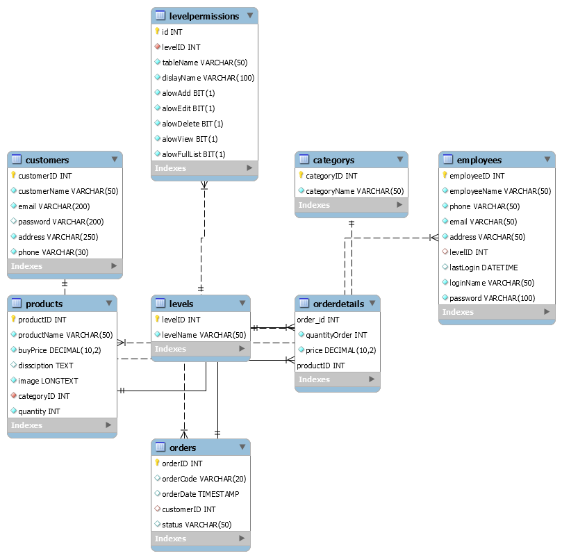

# Case-Study-PHP
- đề tài quản lý bán hàng (áo quần..)
sử dụng công nghệ ngôn nhữ lập trình html, css, bootstrap, php và database MySQL
- thành phần : + trang admin 
               + trang client
+ trang  admin(dashboar) cho phép : + thêm sản phẩm, sửa sản phẩm ,xóa sản phẩm, 
                          + thêm nhân viên, sửa nhân viên, xóa nhân viên,
                          + theo dõi vốn đầu tư, lợi nhuận, hàng tồn kho,hàng mới nhập
                          + theo dõi đơn hàng, danh sách khách hàng.
+ trang clinet cho phép khách hàng.

